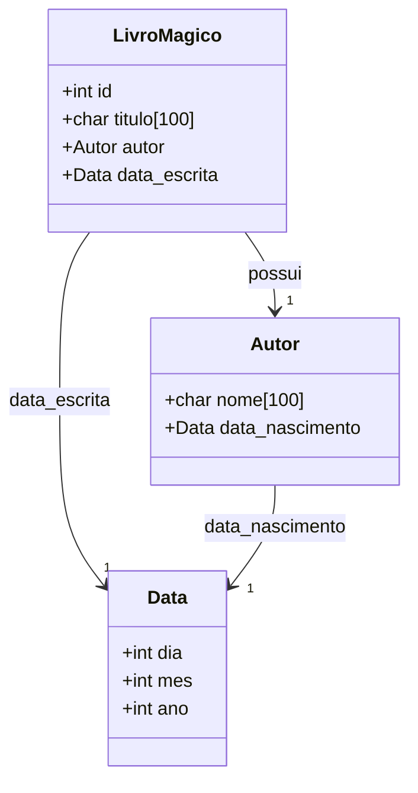
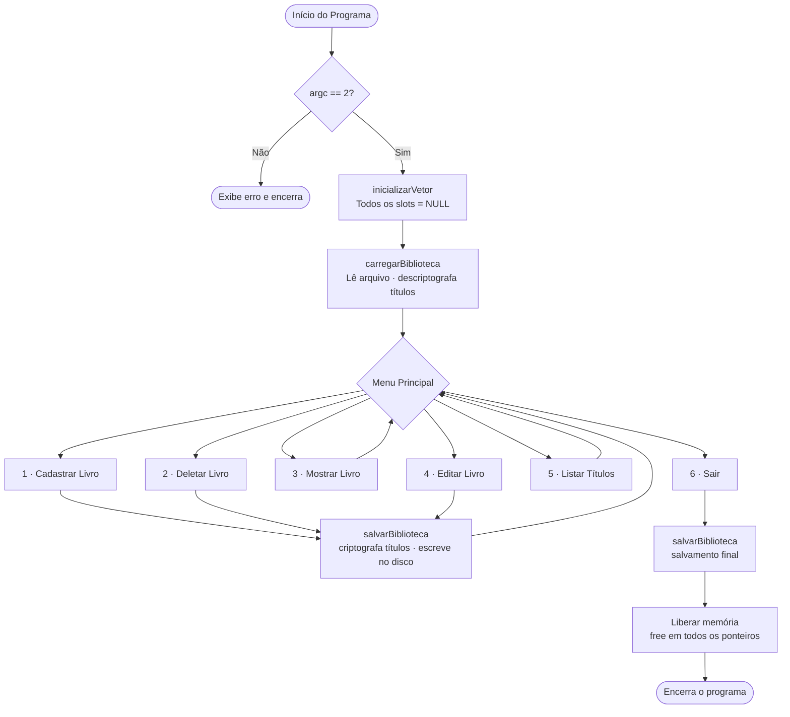
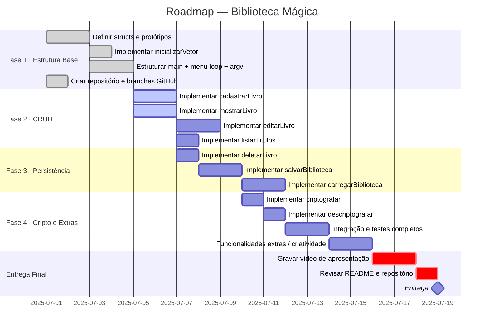

# 📚 Biblioteca Mágica — Mini Projeto 03

> **Backend de Inventário para Jogo de RPG** | Structs · Ponteiros · Alocação Dinâmica · Arquivos em C

[]()
[]()
[]()

---

## 📋 Tabela de Conteúdos

- [Sobre o Projeto](#-sobre-o-projeto)
- [Estrutura de Dados](#-estrutura-de-dados)
- [Arquitetura do Sistema](#-arquitetura-do-sistema)
- [Funcionalidades](#-funcionalidades)
- [Roadmap](#-roadmap)
- [Divisão de Tarefas](#-divisão-de-tarefas)
- [Como Compilar e Executar](#-como-compilar-e-executar)
- [Menu e Uso do Sistema](#-menu-e-uso-do-sistema)
- [Casos de Teste](#-casos-de-teste)
- [Estrutura de Arquivos](#-estrutura-de-arquivos)
- [Integrantes](#-integrantes)
- [Repositório](#-repositório)

---

## 🏰 Sobre o Projeto

**Biblioteca Mágica** é o sistema de backend do inventário para um jogo de RPG, desenvolvido como Mini Projeto 03 da disciplina de Programação de Computadores. O sistema gerencia um catálogo de **livros mágicos** colecionados pelo jogador durante a campanha, com persistência de dados em arquivo (save game) e criptografia dos títulos armazenados.

O sistema é construído inteiramente em **C**, explorando os seguintes conceitos:

- `struct` aninhadas para modelagem de dados complexos
- Vetor de ponteiros com alocação dinâmica (`malloc` / `free`)
- Leitura e escrita em arquivos com `argc`/`argv`
- Criptografia por complemento de 255

---

## 🧱 Estrutura de Dados

O sistema é modelado por três structs aninhadas:



> **Inventário em memória:** `LivroMagico *biblioteca[100]` — vetor de 100 ponteiros onde `NULL` indica slot vazio e um ponteiro válido indica livro cadastrado.

---

## 🏗️ Arquitetura do Sistema



> **Fluxo de criptografia:** ao **carregar**, os títulos passam por `descriptografar()` logo após a leitura do disco; ao **salvar**, os títulos passam por `criptografar()` antes de serem gravados.

---

## ⚙️ Funcionalidades

| # | Função | Responsável | Descrição |
|---|---|---|---|
| 1 | `inicializarVetor()` | Dev 1 | Inicializa todas as 100 posições do vetor com `NULL` |
| 2 | `cadastrarLivro()` | Dev 1 | Aloca dinamicamente um novo livro e insere no vetor |
| 3 | `mostrarLivro()` | Dev 2 | Busca pelo `id` e exibe todos os atributos formatados |
| 4 | `editarLivro()` | Dev 2 | Busca pelo `id` e permite reescrita de cada campo |
| 5 | `listarTitulos()` | Dev 2 | Lista `id` + `titulo` de todos os slots ocupados |
| 6 | `deletarLivro()` | Dev 3 | Libera memória do livro pelo `id`, retorna `NULL` ao slot |
| 7 | `salvarBiblioteca()` | Dev 3 | Persiste os dados no arquivo com títulos criptografados |
| 8 | `carregarBiblioteca()` | Dev 3 | Lê o arquivo e restaura o inventário na memória |
| 9 | `criptografar()` | Dev 4 | Aplica complemento de 255 em cada `char` do título |
| 10 | `descriptografar()` | Dev 4 | Reverte a criptografia (operação auto-inversa) |

---

## 🗺️ Roadmap



### Detalhamento das Fases

| Fase | Objetivo | Entregável |
|---|---|---|
| **1 — Estrutura Base** | Definir structs, protótipos e estrutura do `main` com menu e `argv` | `main.c` compilável com menu exibido |
| **2 — CRUD** | Implementar cadastro, visualização, edição e listagem | Funções CRUD testadas isoladamente |
| **3 — Persistência** | Implementar leitura/escrita em arquivo com save/load funcional | `salvar` e `carregar` integrados ao fluxo |
| **4 — Cripto & Extras** | Criptografar títulos e adicionar funcionalidades criativas | Sistema completo, integrado e testado |
| **Entrega** | Vídeo de 15–20 min, README final, push completo no GitHub | Todos os arquivos obrigatórios entregues |

---

## 👥 Divisão de Tarefas

> Cada desenvolvedor é o **responsável principal** pelas suas tarefas, mas revisão cruzada entre membros é encorajada. O repositório deve conter commits de todos os integrantes.

---

### 👤 Desenvolvedor 1 — Nome
**Papel: Estrutura Base & Cadastro**

| Tarefa | Descrição | Prioridade |
|---|---|---|
| Definição das structs | Escrever `Data`, `Autor` e `LivroMagico` em `structs.h` | 🔴 Alta |
| `inicializarVetor()` | Percorrer o vetor e setar todas as posições como `NULL` | 🔴 Alta |
| `cadastrarLivro()` | Ler dados do usuário, alocar com `malloc`, gerar `id` único e inserir no vetor | 🔴 Alta |
| `main()` + menu loop | Estruturar o `main`, receber e validar `argv`, imprimir o menu em loop e despachar chamadas | 🔴 Alta |
| Organização do repositório | Criar repositório no GitHub, configurar estrutura de pastas e proteger a branch `main` | 🟡 Média |

**Dicas de implementação:**
- O `id` pode ser gerado como um contador global incrementado a cada cadastro — certifique-se de que ele persiste no arquivo.
- Valide se o vetor está cheio (todas as 100 posições ocupadas) antes de tentar cadastrar.

---

### 👤 Desenvolvedor 2 — Nome
**Papel: Visualização & Edição**

| Tarefa | Descrição | Prioridade |
|---|---|---|
| `mostrarLivro()` | Iterar o vetor, buscar pelo `id` e exibir todos os campos formatados | 🔴 Alta |
| `editarLivro()` | Iterar o vetor, buscar pelo `id` e permitir a reescrita campo a campo | 🔴 Alta |
| `listarTitulos()` | Percorrer o vetor completo e imprimir `id` + `titulo` de cada slot ocupado | 🔴 Alta |
| Formatação de saída | Garantir que as informações sejam exibidas de forma clara e legível no terminal | 🟡 Média |

**Dicas de implementação:**
- Em `mostrarLivro()`, exiba também a data de nascimento do autor e a data de escrita formatadas como `DD/MM/AAAA`.
- Em `editarLivro()`, permita que o usuário edite campo por campo e confirme ao final — isso melhora a UX.
- Em `listarTitulos()`, exiba o total de livros cadastrados ao final da listagem.

---

### 👤 Desenvolvedor 3 — Nome
**Papel: Deleção & Persistência em Arquivo**

| Tarefa | Descrição | Prioridade |
|---|---|---|
| `deletarLivro()` | Buscar pelo `id`, chamar `free()` e setar o slot como `NULL` | 🔴 Alta |
| `salvarBiblioteca()` | Abrir arquivo no modo escrita, criptografar o título e gravar todos os registros | 🔴 Alta |
| `carregarBiblioteca()` | Abrir arquivo no modo leitura, alocar dinamicamente cada livro e descriptografar o título | 🔴 Alta |
| Integração arquivo ↔ menu | Garantir que `salvarBiblioteca()` seja chamada após cadastros, edições e deleções | 🟡 Média |

**Dicas de implementação:**
- Em `salvarBiblioteca()`, grave apenas os slots não-`NULL`, e inclua o `id` no arquivo para evitar conflitos de numeração ao recarregar.
- Em `carregarBiblioteca()`, se o arquivo não existir, apenas retorne sem erro — o sistema iniciará com inventário vazio.
- Coordene com o **Dev 4** para garantir que `criptografar()` e `descriptografar()` estejam prontas antes de integrar ao I/O.

---

### 👤 Desenvolvedor 4 — Nome
**Papel: Criptografia, Criatividade & Apresentação**

| Tarefa | Descrição | Prioridade |
|---|---|---|
| `criptografar()` | Aplicar complemento de 255 (`255 - (unsigned char)c`) em cada `char` do título | 🔴 Alta |
| `descriptografar()` | Aplicar novamente o complemento (operação idêntica — auto-inversa) | 🔴 Alta |
| Funcionalidades extras | Adicionar features criativas ao sistema (ver sugestões abaixo) | 🟡 Média |
| README.md | Manter o `README.md` atualizado com uso, integrantes e link do GitHub | 🟡 Média |
| Coordenação do vídeo | Organizar o roteiro e coordenar a gravação da apresentação (15–20 min) | 🔴 Alta |

**Sugestões de funcionalidades extras:**
- Busca por nome do autor
- Ordenação da listagem por título ou por `id`
- Coloração do terminal com códigos ANSI
- Contador de livros no menu principal
- Validação de datas (dia, mês e ano dentro de limites plausíveis)
- Confirmação antes de deletar (`"Tem certeza? (s/n)"`)

---

## 🔨 Como Compilar e Executar

### Pré-requisitos

- GCC instalado: `gcc --version`
- Sistema Linux, macOS ou WSL no Windows

### Compilação (arquivo único)

```bash
gcc -o biblioteca main.c -Wall -Wextra
```

### Compilação (múltiplos arquivos — estrutura modular)

```bash
gcc -o biblioteca main.c biblioteca.c arquivo.c cripto.c -Wall -Wextra
```

### Execução

O nome do arquivo de dados **deve** ser passado como argumento de linha de comando:

```bash
./biblioteca dados.txt
```

> Se `dados.txt` não existir, o sistema iniciará com inventário vazio e criará o arquivo na primeira operação de salvamento.

---

## 🎮 Menu e Uso do Sistema

Ao executar o programa, o seguinte menu será exibido em loop até que o usuário escolha sair:

```
╔══════════════════════════════════════╗
║      📚  BIBLIOTECA MÁGICA  📚       ║
╠══════════════════════════════════════╣
║  [1] Cadastrar livro                 ║
║  [2] Deletar livro                   ║
║  [3] Mostrar livro                   ║
║  [4] Editar livro                    ║
║  [5] Listar títulos                  ║
║  [6] Sair                            ║
╚══════════════════════════════════════╝
Escolha uma opção: _
```

### Exemplo — Cadastrar Livro (Opção 1)

```
Digite o título do livro: Grimório das Sombras
Digite o nome do autor: Valdris Mourne
Data de nascimento do autor (dd mm aaaa): 12 03 874
Data de escrita do livro (dd mm aaaa): 07 11 1203
✔ Livro cadastrado com sucesso! ID: 1
```

### Exemplo — Listar Títulos (Opção 5)

```
=== Livros na Biblioteca ===
[ID 1] Grimório das Sombras
[ID 2] Codex da Lua Vermelha
[ID 3] Tomo do Vazio Eterno
Total: 3 livro(s) cadastrado(s)
```

### Exemplo — Mostrar Livro (Opção 3)

```
Digite o ID do livro: 2
─────────────────────────────────
 📖 ID: 2
 Título:       Codex da Lua Vermelha
 Autor:        Seraphina Vael
 Nascimento:   03/09/1051
 Data Escrita: 22/04/1388
─────────────────────────────────
```

---

## 🧪 Casos de Teste

| # | Cenário | Entrada | Resultado Esperado |
|---|---|---|---|
| 1 | Cadastrar livro válido | Preencher todos os campos | Livro aparece em "Listar Títulos" com `id` gerado |
| 2 | Deletar livro existente | `id` válido | Slot liberado; livro não aparece mais na listagem |
| 3 | Deletar livro inexistente | `id` que não existe no vetor | Mensagem de erro; nenhuma alteração no inventário |
| 4 | Editar livro | Novo título para `id` existente | Título atualizado exibido na listagem |
| 5 | Persistência (save/load) | Fechar e reabrir com o mesmo arquivo | Todos os livros persistem; títulos legíveis após descriptografia |
| 6 | Inventário cheio | Cadastrar o 101º livro | Sistema informa que o inventário está cheio e bloqueia a operação |
| 7 | Cadastrar após deleção | Deletar um livro e cadastrar novo | Novo livro ocupa slot vazio; `id` único gerado corretamente |
| 8 | Arquivo inexistente | Executar com arquivo que não existe | Sistema inicia com inventário vazio sem travar |

---

## 📁 Estrutura de Arquivos

```
biblioteca-magica/
│
├── main.c              # Ponto de entrada, menu principal, loop de interação
├── structs.h           # Definição das structs Data, Autor e LivroMagico
│
├── biblioteca.c        # Funções de gerenciamento do vetor (CRUD)
├── biblioteca.h        # Protótipos das funções de CRUD
│
├── arquivo.c           # Funções salvarBiblioteca e carregarBiblioteca
├── arquivo.h           # Protótipos de I/O
│
├── cripto.c            # Funções criptografar e descriptografar
├── cripto.h            # Protótipos de criptografia
│
├── dados.txt           # Arquivo de dados gerado em execução (não versionar)
├── .gitignore          # Ignorar binários e arquivos de dados
└── README.md           # Este arquivo
```

> **Alternativa simples:** o grupo pode optar por um único arquivo `main.c` contendo todas as funções, caso prefira simplicidade na compilação.

---

## 👨‍💻 Integrantes

| # | Nome | GitHub |
|---|---|---|
| 1 | Desenvolvedor 1 — Nome | [@usuario](https://github.com/usuario) |
| 2 | Desenvolvedor 2 — Nome | [@usuario](https://github.com/usuario) |
| 3 | Desenvolvedor 3 — Nome | [@usuario](https://github.com/usuario) |
| 4 | Desenvolvedor 4 — Nome | [@usuario](https://github.com/usuario) |

---

## 🔗 Repositório

> **[github.com/seu-usuario/biblioteca-magica](https://github.com/seu-usuario/biblioteca-magica)**

---

<div align="center">

*Desenvolvido para a disciplina de Programação de Computadores*  
*Universidade Federal de Goiás (UFG)*

</div>