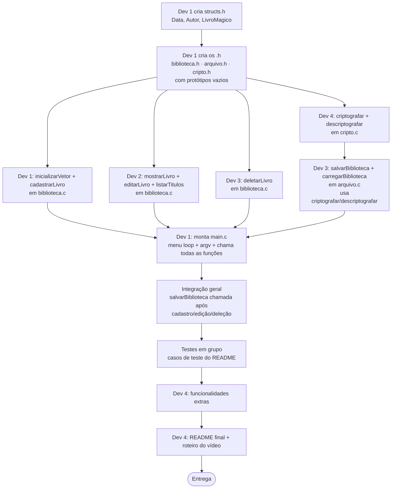

# 🔄 Fluxo de Trabalho — Biblioteca Mágica

> Quem faz o quê, em que ordem, e quem depende de quem — baseado na estrutura de arquivos e na divisão de tarefas do README.

---

## 🧩 Lógica por trás da ordem

Olhando a estrutura de arquivos do projeto, existe uma dependência clara:

```
structs.h  →  biblioteca.h / arquivo.h / cripto.h (protótipos)  →  .c de cada um
```

Ninguém consegue compilar `mostrarLivro()`, `deletarLivro()` ou `criptografar()` sem antes saber **como é a struct `LivroMagico`**. Então o projeto trava em um único ponto de partida: **Dev 1**.

A boa notícia é que, depois desse primeiro passo, três frentes podem rodar **em paralelo** sem se atrapalhar — exceto a costura final entre Dev 3 e Dev 4, que precisa ser sequencial.

---

## 🗺️ Diagrama de dependências



---

## 🚦 Etapas passo a passo

### Etapa 0 — Antes de qualquer código (Dev 1)
- Cria o repositório no GitHub, estrutura de pastas e protege a branch `main`.
- **Ninguém mais começa antes disso existir.**

### Etapa 1 — Bloqueante: definição das structs (Dev 1)
- Arquivo: `structs.h`
- Cria `Data`, `Autor` e `LivroMagico`.
- Cria também os `.h` vazios (`biblioteca.h`, `arquivo.h`, `cripto.h`) só com os **protótipos** das funções de cada um — mesmo sem implementação ainda.
- **Por quê isso primeiro:** todo mundo (Dev 2, 3 e 4) escreve código que manipula `LivroMagico *`. Sem isso definido, ninguém compila nada.
- 📣 Dev 1 deve avisar o grupo assim que isso for pra branch `main` (ou `develop`) — esse é o sinal verde pro resto começar.

### Etapa 2 — Trabalho em paralelo (Dev 1, Dev 2, Dev 4 ao mesmo tempo)
Depois da Etapa 1, três pessoas podem trabalhar sem esperar uma pela outra:

| Quem | Arquivo | Função(ões) | Depende de |
|---|---|---|---|
| **Dev 1** | `biblioteca.c` | `inicializarVetor()`, `cadastrarLivro()` | só de `structs.h` |
| **Dev 2** | `biblioteca.c` | `mostrarLivro()`, `editarLivro()`, `listarTitulos()` | só de `structs.h` |
| **Dev 4** | `cripto.c` | `criptografar()`, `descriptografar()` | nada — é a função mais isolada do projeto, pode começar **imediatamente**, nem precisa esperar a struct (só mexe em `char[]`) |
| **Dev 3** | `biblioteca.c` | `deletarLivro()` | só de `structs.h` |

> ⚠️ Como Dev 1, Dev 2 e Dev 3 escrevem no **mesmo arquivo** (`biblioteca.c`), combine previamente quem cria o arquivo base e como vai ser o merge (ideal: cada um na sua branch, ex. `feature/cadastrar`, `feature/mostrar-editar-listar`, `feature/deletar`, e PR separado pra cada).

### Etapa 3 — Dependência sequencial: persistência (Dev 3 espera Dev 4)
- Arquivo: `arquivo.c`
- `salvarBiblioteca()` e `carregarBiblioteca()` **chamam diretamente** `criptografar()` e `descriptografar()`.
- Dev 3 **não consegue finalizar** essa parte sem que Dev 4 tenha terminado (ou pelo menos estabilizado a assinatura de) `criptografar()`/`descriptografar()`.
- 📣 Dev 4 deve avisar Dev 3 assim que `cripto.c` estiver pronto e testado isoladamente (ex: criptografar e descriptografar uma string de teste e ver se volta igual).

### Etapa 4 — Montagem do `main.c` (Dev 1)
- Dev 1 estrutura o `main()`: valida `argc`/`argv`, chama `carregarBiblioteca()` no início, exibe o menu em loop e despacha pras funções de cada um.
- Esse passo só fica **completo de verdade** quando as 4 frentes (cadastro, mostrar/editar/listar, deletar, salvar/carregar) já existem — mas Dev 1 pode ir montando o esqueleto do menu antes disso, usando chamadas "stub" (funções vazias que só dão `printf("TODO")`) e trocando pelas reais conforme cada PR for mergeado.

### Etapa 5 — Integração geral
- Conferir que `salvarBiblioteca()` é chamada depois de **cada** cadastro, edição e deleção (não só na saída do programa).
- Esse é o ponto onde o grupo todo deveria revisar junto — é fácil esquecer de chamar o save em algum fluxo.

### Etapa 6 — Testes (todo o grupo)
- Rodar os 8 casos de teste do README (cadastro válido, deletar inexistente, inventário cheio, persistência save/load, etc).
- Ideal dividir: cada dev testa o que **não** implementou (revisão cruzada), pra pegar bugs que o autor não vê.

### Etapa 7 — Extras + Entrega (Dev 4 coordena)
- Funcionalidades extras (busca por autor, ordenação, cores ANSI, confirmação de exclusão, validação de data).
- README final atualizado.
- Roteiro e gravação do vídeo de 15–20 min.

---

## ✅ Resumo rápido — "quem trava quem"

- **Dev 1 trava todo mundo** no início (structs.h precisa existir primeiro).
- **Dev 4 trava o Dev 3** na parte de persistência (cripto precisa estar pronta antes do save/load funcionar de ponta a ponta).
- **Dev 2 e Dev 4 não travam ninguém** depois da Etapa 1 — podem trabalhar de forma totalmente independente até a integração final.
- **Dev 1 trava a integração final** (main.c só fica 100% funcional quando recebe as peças dos outros três).

---

## 💡 Sugestão prática pro grupo

Criem um canal/thread só pra avisos de "terminei X, pode puxar". Os dois avisos mais importantes do projeto são:
1. Dev 1: *"structs.h e os .h estão na main, podem começar."*
2. Dev 4: *"cripto.c testado e funcionando, Dev 3 pode integrar."*

Sem esses dois avisos, o resto do grupo fica sem saber quando pode avançar com segurança.